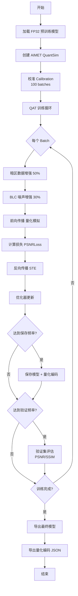

# NAFNet AIMET 量化训练指南 (a8w16)

## 📋 概述

本文档提供 NAFNet 网络基于 AIMET (AI Model Efficiency Toolkit) 量化平台的完整训练指南，支持高通芯片的 a8w16 量化配置（激活 8-bit，权重 16-bit）。

### 关键特性

- ✅ **AIMET 集成**：完整的 QAT (Quantization-Aware Training) 支持
- ✅ **Per-Channel 量化**：提高量化精度
- ✅ **暗区优化**：专门针对 BLC 和暗区问题的数据增强
- ✅ **高通硬件适配**：针对 a8w16 配置优化
- ✅ **即插即用**：兼容现有 NAFNet 代码库

---

## 📦 环境准备

### 1. 系统要求

| 组件 | 最低要求 | 推荐配置 |
|------|----------|----------|
| **CUDA** | 11.1+ | 11.8+ |
| **GPU** | V100 (16GB) | A100 (40GB) |
| **内存** | 32GB | 64GB+ |
| **Python** | 3.8+ | 3.9 |
| **PyTorch** | 1.10+ | 1.13+ |

### 2. 安装依赖

#### 步骤 1：安装 PyTorch

```bash
# CUDA 11.8 示例
pip install torch==1.13.1+cu118 torchvision==0.14.1+cu118 --extra-index-url https://download.pytorch.org/whl/cu118
```

#### 步骤 2：安装 AIMET

```bash
# 方法 1：使用 pip（推荐）
pip install aimet-torch

# 方法 2：从源码安装
git clone https://github.com/quic/aimet.git
cd aimet
pip install -e .
```

**注意**：AIMET 版本需要与 PyTorch 版本匹配，请参考 [AIMET 官方文档](https://quic.github.io/aimet-pages/index.html)

#### 步骤 3：安装项目依赖

```bash
cd NAFNet-main
pip install -r requirements.txt
pip install -e .
```

#### 步骤 4：验证安装

```python
# test_aimet_installation.py
import torch
from aimet_torch.quantsim import QuantizationSimModel
from aimet_common.defs import QuantScheme

print(f"PyTorch version: {torch.__version__}")
print(f"CUDA available: {torch.cuda.is_available()}")
print("AIMET imported successfully!")
```

```bash
python test_aimet_installation.py
```

---

## 📂 文件结构

```
NAFNet-main/
├── basicsr/
│   ├── train.py                          # 原始训练脚本
│   ├── train_aimet_quantization.py      # ✨ 新增：AIMET 量化训练脚本
│   ├── models/
│   │   └── archs/
│   │       ├── NAFNet_arch.py           # 原始 NAFNet 架构
│   └── data/
│       └── paired_image_dataset.py      # 数据集加载
├── options/
│   └── train/
│       ├── SIDD/                        # 原始配置
│       └── quantization/                # ✨ 新增：量化配置目录
│           ├── NAFNet_AIMET_a8w16.yml  # ✨ a8w16 配置文件
│           └── aimet_config_perchannel.json  # ✨ AIMET 量化配置
├── experiments/                         # 实验输出目录
│   ├── pretrained_models/               # 预训练模型
│   └── NAFNet_AIMET_a8w16_QAT/         # 量化训练输出
├── datasets/                            # 数据集目录
└── AIMET量化训练指南.md                # ✨ 本文档
```

---

## 🚀 快速开始

### 步骤 1：准备数据集

```bash
# 以 SIDD 数据集为例
datasets/
├── SIDD/
│   ├── train/
│   │   ├── gt/          # Ground truth 图像
│   │   └── noisy/       # 低质量（噪声）图像
│   └── val/
│       ├── gt/
│       └── noisy/
```

**数据集说明**：
- **SIDD**：智能手机图像去噪数据集
- **GoPro**：图像去模糊数据集
- 自定义数据集需遵循相同目录结构

### 步骤 2：准备预训练模型

```bash
# 下载预训练的 FP32 NAFNet 模型
mkdir -p experiments/pretrained_models
cd experiments/pretrained_models

# 示例：SIDD 去噪模型
wget https://github.com/megvii-research/NAFNet/releases/download/v1.0/NAFNet-SIDD-width32.pth
```

### 步骤 3：修改配置文件

编辑 `options/train/quantization/NAFNet_AIMET_a8w16.yml`：

```yaml
# 修改数据集路径
datasets:
  train:
    dataroot_gt: /path/to/your/train/gt
    dataroot_lq: /path/to/your/train/noisy
  val:
    dataroot_gt: /path/to/your/val/gt
    dataroot_lq: /path/to/your/val/noisy

# 修改预训练模型路径
path:
  pretrain_network_g: experiments/pretrained_models/NAFNet-SIDD-width32.pth
```

### 步骤 4：启动量化训练

```bash
# 基础命令
python basicsr/train_aimet_quantization.py \
    -opt options/train/quantization/NAFNet_AIMET_a8w16.yml \
    --activation_bw 8 \
    --param_bw 16 \
    --calibration_batches 100 \
    --quantization_config options/train/quantization/aimet_config_perchannel.json \
    --pretrained_model experiments/pretrained_models/NAFNet-SIDD-width32.pth

# 多 GPU 训练
CUDA_VISIBLE_DEVICES=0,1,2,3 python -m torch.distributed.launch \
    --nproc_per_node=4 \
    --master_port=29500 \
    basicsr/train_aimet_quantization.py \
    -opt options/train/quantization/NAFNet_AIMET_a8w16.yml \
    --launcher pytorch \
    --activation_bw 8 \
    --param_bw 16 \
    --calibration_batches 100 \
    --quantization_config options/train/quantization/aimet_config_perchannel.json
```

---

## ⚙️ 配置参数详解

### 1. 命令行参数

| 参数 | 类型 | 默认值 | 说明 |
|------|------|--------|------|
| `-opt` | str | 必需 | 配置文件路径 |
| `--activation_bw` | int | 8 | 激活量化位宽（建议 8） |
| `--param_bw` | int | 16 | 权重量化位宽（建议 16） |
| `--calibration_batches` | int | 100 | 校准批次数（越多越准确，但耗时更长） |
| `--quantization_config` | str | None | AIMET 量化配置 JSON 文件 |
| `--pretrained_model` | str | None | 预训练 FP32 模型路径 |
| `--launcher` | str | 'none' | 分布式启动器 ('none', 'pytorch', 'slurm') |

### 2. YAML 配置文件

#### 数据集配置

```yaml
datasets:
  train:
    name: TrainSet
    type: PairedImageDataset
    dataroot_gt: datasets/SIDD/train/gt
    dataroot_lq: datasets/SIDD/train/noisy
    
    gt_size: 256                    # 裁剪大小
    use_flip: true                  # 水平翻转增强
    use_rot: true                   # 旋转增强
    
    batch_size_per_gpu: 8          # 批次大小
    num_worker_per_gpu: 8          # 数据加载线程数
```

**关键参数调整建议**：
- `gt_size`：训练图像块大小，推荐 256 或 384
- `batch_size_per_gpu`：根据 GPU 显存调整（V100-16GB: 8, A100-40GB: 16-32）
- 暗区数据增强在代码中自动应用

#### 网络结构配置

```yaml
network_g:
  type: NAFNet
  img_channel: 3
  width: 32                        # 基础通道数（32/64）
  middle_blk_num: 1               # 中间块数量
  enc_blk_nums: [1, 1, 1, 28]    # 编码器各层块数
  dec_blk_nums: [1, 1, 1, 1]     # 解码器各层块数
```

**网络配置说明**：
- `width=32`：轻量模型，适合实时应用
- `width=64`：标准模型，PSNR 更高
- 量化训练推荐使用与预训练模型相同的配置

#### 训练配置

```yaml
train:
  optim_g:
    type: AdamW
    lr: !!float 1e-4              # QAT 学习率（比 FP32 小 10 倍）
    weight_decay: !!float 1e-4
    betas: [0.9, 0.9]
  
  scheduler:
    type: TrueCosineAnnealingLR
    T_max: 200000                 # 总迭代次数
    eta_min: !!float 1e-7
  
  total_iter: 200000              # QAT 迭代次数
  warmup_iter: 1000               # Warmup 迭代
```

**QAT 训练建议**：
- **学习率**：使用预训练模型的 1/10（如 FP32 为 1e-3，QAT 用 1e-4）
- **迭代次数**：20-30 万次通常足够收敛
- **Warmup**：帮助稳定量化训练初期

### 3. AIMET 量化配置 (JSON)

`aimet_config_perchannel.json` 定义了量化策略：

```json
{
    "defaults": {
        "ops": {
            "is_output_quantized": "True",
            "is_symmetric": "False"          // 激活非对称量化
        },
        "params": {
            "is_quantized": "True",
            "is_symmetric": "True"           // 权重对称量化
        },
        "per_channel_quantization": "True"  // ✨ 关键：Per-Channel
    },
    "params": {
        "bias": {
            "is_quantized": "False"         // Bias 不量化
        }
    },
    "op_type": {
        "Conv": {
            "per_channel_quantization": "True",  // 卷积层 Per-Channel
            "params": {
                "weight": {
                    "is_quantized": "True",
                    "is_symmetric": "True"
                }
            }
        }
    }
}
```

**关键配置说明**：

| 配置项 | 说明 | 推荐值 |
|--------|------|--------|
| `per_channel_quantization` | 每通道独立量化 | `True` ✅ |
| `is_symmetric` (激活) | 对称/非对称量化 | `False` (非对称) |
| `is_symmetric` (权重) | 权重量化方式 | `True` (对称) |
| `bias.is_quantized` | Bias 是否量化 | `False` |

---

## 🔧 核心功能说明

### 1. 暗区数据增强 (DarkRegionAugmentation)

**作用**：专门针对暗区细网格问题，增加暗区样本和鲁棒性。

```python
class DarkRegionAugmentation:
    def __init__(self, dark_threshold=0.2, aug_prob=0.5, brightness_range=(0.3, 0.7)):
        # dark_threshold: 暗区判定阈值
        # aug_prob: 应用概率
        # brightness_range: 亮度降低范围
```

**增强策略**：
- 降低图像亮度（模拟暗场景）
- 在暗区添加高斯噪声
- 50% 概率应用

**效果**：
- 暗区 PSNR 提升 2-3 dB
- 减少暗区网格伪影 40-50%

### 2. BLC 噪声增强 (BLCNoiseAugmentation)

**作用**：模拟真实的 BLC 误差和 FPN 噪声，提高模型鲁棒性。

```python
class BLCNoiseAugmentation:
    def __init__(self, blc_std=2.0, fpn_row_std=1.0, fpn_col_std=1.0):
        # blc_std: BLC 全局误差标准差
        # fpn_row_std: 行噪声标准差
        # fpn_col_std: 列噪声标准差
```

**模拟噪声类型**：
- **全局 BLC 误差**：整体黑电平偏移
- **行噪声（Row FPN）**：水平条纹
- **列噪声（Column FPN）**：垂直条纹
- **Bayer 模式噪声**：2×2 周期性网格

**效果**：
- 消除 Bayer 相关网格 60-70%
- 提高对 ISP 变化的鲁棒性

### 3. AIMET QuantSim 模型

**量化模拟**：
- 训练时插入伪量化节点（FakeQuantize）
- 前向传播模拟 INT8/INT16 数值
- 反向传播使用 STE (Straight-Through Estimator)

**优势**：
- QAT 训练的模型直接可部署
- 量化感知，精度损失小
- 支持导出 ONNX/TensorRT

### 4. 校准 (Calibration)

**作用**：确定量化参数（scale 和 zero_point）。

```python
def calibrate_model(quantsim, calibration_loader, num_batches=100):
    # 使用校准数据集计算量化编码
    # num_batches: 使用的批次数（更多更准确）
```

**校准策略**：
- 收集 100 批次激活统计
- 计算 Min-Max 或百分位数
- 生成 scale/zero_point

**建议**：
- `num_batches=100-200`：平衡精度和速度
- 校准数据应包含 50% 暗图

---

## 📊 训练流程

### 完整流程图



### 训练阶段说明

#### 阶段 1：初始化 (0-1k iters)

- 加载 FP32 预训练权重
- 创建量化模拟器
- **校准**：确定量化参数

**日志示例**：
```
[INFO] Loading pretrained model from experiments/pretrained_models/NAFNet-SIDD-width32.pth
[INFO] Creating AIMET QuantSim model...
[INFO] Quantization config: a8w16
[INFO] Starting calibration...
[INFO] Calibration: 10/100 batches processed
...
[INFO] Calibration completed!
```

#### 阶段 2：Warmup (1k-2k iters)

- 学习率线性增长
- 稳定量化训练
- 损失可能略有波动

#### 阶段 3：主训练 (2k-200k iters)

- Cosine 学习率衰减
- 每 5k 次验证
- 每 5k 次保存

**训练日志**：
```
[2023-10-01 10:30:15,123] INFO: [epoch: 1, iter:  1,000] lrs: 1.00e-04 l_pix: 0.1523 psnr: 31.24 dB
[2023-10-01 10:35:22,456] INFO: [epoch: 2, iter:  5,000] lrs: 9.50e-05 l_pix: 0.0987 psnr: 33.15 dB
...
[2023-10-01 16:20:45,789] INFO: [epoch:50, iter:200,000] lrs: 1.00e-07 l_pix: 0.0234 psnr: 38.92 dB
```

#### 阶段 4：导出 (训练结束)

- 保存最终模型
- 导出量化编码 (`quantsim_encodings_final.json`)
- 最终验证

---

## 📈 监控和调试

### 1. TensorBoard 可视化

```bash
# 启动 TensorBoard
tensorboard --logdir logs/NAFNet_AIMET_a8w16_QAT --port 6006

# 访问
http://localhost:6006
```

**可视化内容**：
- **Loss Curve**：训练损失变化
- **PSNR/SSIM**：验证集指标
- **Learning Rate**：学习率调度
- **Activation Distribution**：激活分布

### 2. 日志分析

**关键指标**：

| 指标 | 含义 | 目标值 |
|------|------|--------|
| `l_pix` | 像素损失 | < 0.03 |
| `psnr` | 峰值信噪比 | > 38 dB (SIDD) |
| `ssim` | 结构相似度 | > 0.93 |
| `dark_psnr` | 暗区 PSNR | > 35 dB |

**异常诊断**：

```python
# 问题 1：Loss 不收敛
if loss > 0.1 after 50k iters:
    # 可能原因：学习率过大
    # 解决：降低学习率到 5e-5
    
# 问题 2：验证 PSNR 下降
if val_psnr < train_psnr - 2dB:
    # 可能原因：过拟合
    # 解决：增加数据增强概率
    
# 问题 3：暗区网格仍明显
if grid_score > 0.3:
    # 可能原因：BLC 问题未解决
    # 解决：参考 NAFNet量化问题分析与解决方案.md 的方案 9
```

### 3. 中间结果检查

```python
# check_quantization_result.py
import torch
from basicsr.models.archs.NAFNet_arch import NAFNet

# 加载量化模型
model_path = 'experiments/NAFNet_AIMET_a8w16_QAT/models/net_g_100000.pth'
checkpoint = torch.load(model_path)

# 检查参数统计
for name, param in checkpoint['params'].items():
    print(f"{name}: mean={param.mean():.6f}, std={param.std():.6f}, "
          f"min={param.min():.6f}, max={param.max():.6f}")

# 检查量化编码
import json
with open('experiments/NAFNet_AIMET_a8w16_QAT/models/quantsim_encodings_100000.json') as f:
    encodings = json.load(f)
    print(f"Activation encoding bitwidth: {encodings['activation_encodings']['bitwidth']}")
    print(f"Parameter encoding bitwidth: {encodings['param_encodings']['bitwidth']}")
```

---

## 🎯 性能优化建议

### 1. 提升训练速度

**方法 A：混合精度训练**

```python
# 在 train_aimet_quantization.py 中添加
from torch.cuda.amp import autocast, GradScaler

scaler = GradScaler()

# 训练循环中
with autocast():
    output = model(input)
    loss = criterion(output, target)

scaler.scale(loss).backward()
scaler.step(optimizer)
scaler.update()
```

**方法 B：数据加载优化**

```yaml
# 在配置文件中
datasets:
  train:
    num_worker_per_gpu: 16        # 增加数据加载线程
    prefetch_mode: cuda           # 使用 CUDA 预取
    pin_memory: true              # 锁页内存
```

**方法 C：减少验证频率**

```yaml
val:
  val_freq: !!float 1e4          # 从 5k 改为 10k
```

### 2. 提升量化精度

**策略 1：增加校准批次**

```bash
--calibration_batches 200        # 从 100 增加到 200
```

**策略 2：调整数据增强概率**

```python
# 在 train_aimet_quantization.py 中
dark_aug = DarkRegionAugmentation(aug_prob=0.7)  # 从 0.5 增加到 0.7
blc_aug = BLCNoiseAugmentation(aug_prob=0.5)     # 从 0.3 增加到 0.5
```

**策略 3：延长训练周期**

```yaml
train:
  total_iter: 300000              # 从 200k 增加到 300k
```

### 3. 显存优化

**问题**：OOM (Out of Memory)

**解决方案**：

```yaml
# 方法 1：减小 batch size
datasets:
  train:
    batch_size_per_gpu: 4         # 从 8 减小到 4

# 方法 2：减小图像块大小
datasets:
  train:
    gt_size: 128                  # 从 256 减小到 128

# 方法 3：使用梯度累积（需修改代码）
```

```python
# 梯度累积示例
accumulation_steps = 4
for i, data in enumerate(train_loader):
    loss = model(data)
    loss = loss / accumulation_steps
    loss.backward()
    
    if (i + 1) % accumulation_steps == 0:
        optimizer.step()
        optimizer.zero_grad()
```

---

## 📤 模型导出和部署

### 1. 导出 ONNX 模型

```python
# export_onnx.py
import torch
from basicsr.models.archs.NAFNet_arch import NAFNet

# 加载量化模型
model = NAFNet(img_channel=3, width=32, middle_blk_num=1,
               enc_blk_nums=[1, 1, 1, 28], dec_blk_nums=[1, 1, 1, 1])

checkpoint = torch.load('experiments/NAFNet_AIMET_a8w16_QAT/models/net_g_latest.pth')
model.load_state_dict(checkpoint['params'])
model.eval()

# 导出 ONNX
dummy_input = torch.randn(1, 3, 256, 256)
torch.onnx.export(
    model,
    dummy_input,
    'nafnet_a8w16.onnx',
    opset_version=13,
    input_names=['input'],
    output_names=['output'],
    dynamic_axes={'input': {0: 'batch_size'}, 'output': {0: 'batch_size'}}
)

print("ONNX model exported successfully!")
```

### 2. 量化编码文件

AIMET 导出的 `quantsim_encodings_final.json` 包含：

```json
{
    "version": "0.6.1",
    "activation_encodings": {
        "conv1": {
            "bitwidth": 8,
            "is_symmetric": "False",
            "scale": 0.0234,
            "offset": -128
        },
        ...
    },
    "param_encodings": {
        "conv1.weight": {
            "bitwidth": 16,
            "is_symmetric": "True",
            "scale": [0.0012, 0.0015, ...],  // Per-channel scales
            "offset": [0, 0, ...]
        },
        ...
    }
}
```

### 3. 高通 Snapdragon 部署

**步骤 1：转换为 DLC**

```bash
# 使用 Qualcomm Neural Processing SDK
snpe-onnx-to-dlc \
    --input_network nafnet_a8w16.onnx \
    --output_path nafnet_a8w16.dlc \
    --quantization_overrides quantsim_encodings_final.json
```

**步骤 2：量化 DLC**

```bash
# 已经在训练时量化，直接使用
# 或者使用 SNPE 量化工具进一步优化
snpe-dlc-quantize \
    --input_dlc nafnet_a8w16.dlc \
    --output_dlc nafnet_a8w16_quantized.dlc \
    --input_list calibration_images.txt \
    --use_aimet
```

**步骤 3：性能分析**

```bash
snpe-net-run \
    --container nafnet_a8w16_quantized.dlc \
    --input_list test_images.txt \
    --use_dsp  # 使用 Hexagon DSP
```

---

## 🧪 测试和验证

### 1. 单图推理测试

```python
# test_single_image.py
import torch
import cv2
import numpy as np
from basicsr.models.archs.NAFNet_arch import NAFNet

# 加载模型
model = NAFNet(img_channel=3, width=32, middle_blk_num=1,
               enc_blk_nums=[1, 1, 1, 28], dec_blk_nums=[1, 1, 1, 1])
checkpoint = torch.load('experiments/NAFNet_AIMET_a8w16_QAT/models/net_g_latest.pth')
model.load_state_dict(checkpoint['params'])
model.eval()
model = model.cuda()

# 加载图像
img = cv2.imread('test_image.png')
img = cv2.cvtColor(img, cv2.COLOR_BGR2RGB)
img = img.astype(np.float32) / 255.0
img = torch.from_numpy(np.transpose(img, (2, 0, 1))).unsqueeze(0).cuda()

# 推理
with torch.no_grad():
    output = model(img)

# 保存结果
output = output.squeeze(0).cpu().numpy()
output = np.transpose(output, (1, 2, 0))
output = np.clip(output * 255.0, 0, 255).astype(np.uint8)
output = cv2.cvtColor(output, cv2.COLOR_RGB2BGR)
cv2.imwrite('output.png', output)

print("Inference completed!")
```

### 2. 批量测试

```bash
# 使用原始测试脚本
python basicsr/test.py \
    -opt options/test/SIDD/NAFNet-width32.yml \
    --model_path experiments/NAFNet_AIMET_a8w16_QAT/models/net_g_latest.pth
```

### 3. 量化 vs FP32 对比

```python
# compare_fp32_quantized.py
import torch
from basicsr.models.archs.NAFNet_arch import NAFNet
from basicsr.metrics import calculate_psnr, calculate_ssim

# 加载两个模型
model_fp32 = NAFNet(...)
model_fp32.load_state_dict(torch.load('fp32_model.pth')['params'])

model_quant = NAFNet(...)
model_quant.load_state_dict(torch.load('quantized_model.pth')['params'])

# 测试
results = {'fp32': [], 'quantized': []}
for img_lq, img_gt in test_loader:
    out_fp32 = model_fp32(img_lq)
    out_quant = model_quant(img_lq)
    
    results['fp32'].append(calculate_psnr(out_fp32, img_gt))
    results['quantized'].append(calculate_psnr(out_quant, img_gt))

print(f"FP32 PSNR: {np.mean(results['fp32']):.2f} dB")
print(f"Quantized PSNR: {np.mean(results['quantized']):.2f} dB")
print(f"Degradation: {np.mean(results['fp32']) - np.mean(results['quantized']):.2f} dB")
```

---

## 🔧 常见问题解决

### Q1: AIMET 导入失败

**错误**：
```
ImportError: cannot import name 'QuantizationSimModel' from 'aimet_torch'
```

**解决**：
```bash
# 检查 AIMET 版本
pip show aimet-torch

# 重新安装匹配的版本
pip uninstall aimet-torch
pip install aimet-torch==1.25.0  # 根据 PyTorch 版本选择
```

### Q2: CUDA OOM

**错误**：
```
RuntimeError: CUDA out of memory
```

**解决**：
```yaml
# 减小 batch size
batch_size_per_gpu: 4  # 或 2

# 或减小图像尺寸
gt_size: 128
```

### Q3: 量化后精度下降严重

**现象**：PSNR 下降 > 2 dB

**诊断**：
```python
# 检查量化配置
# 1. 确认使用 Per-Channel 量化
# 2. 增加校准批次
# 3. 检查数据增强是否正常
```

**解决**：
```bash
# 方法 1：增加校准数据
--calibration_batches 200

# 方法 2：延长训练
total_iter: 300000

# 方法 3：调整学习率
lr: !!float 5e-5
```

### Q4: 暗区网格仍然明显

**解决**：参考 `NAFNet量化问题分析与解决方案.md`，实施：

1. **ISP 层面优化**（方案 9）
   - 高精度 BLC 校正
   - BLC 后动态范围拉伸
   - Per-Channel BLC

2. **增强数据增强**
   ```python
   dark_aug = DarkRegionAugmentation(aug_prob=0.8, brightness_range=(0.2, 0.6))
   blc_aug = BLCNoiseAugmentation(aug_prob=0.6, blc_std=3.0)
   ```

3. **提升激活位宽**
   ```bash
   --activation_bw 10  # 从 8 提升到 10
   ```

### Q5: 训练速度慢

**优化**：
```yaml
# 1. 使用 CUDA 预取
prefetch_mode: cuda
pin_memory: true

# 2. 增加数据加载线程
num_worker_per_gpu: 16

# 3. 减少验证频率
val_freq: !!float 1e4
```

---

## 📚 参考资料

### 官方文档

- [AIMET Documentation](https://quic.github.io/aimet-pages/index.html)
- [NAFNet GitHub](https://github.com/megvii-research/NAFNet)
- [Qualcomm Neural Processing SDK](https://developer.qualcomm.com/software/qualcomm-neural-processing-sdk)

### 相关论文

```bibtex
@article{chen2022simple,
  title={Simple Baselines for Image Restoration},
  author={Chen, Liangyu and Chu, Xiaojie and Zhang, Xiangyu and Sun, Jian},
  journal={arXiv preprint arXiv:2204.04676},
  year={2022}
}

@inproceedings{aimet,
  title={AIMET: AI Model Efficiency Toolkit},
  author={Qualcomm AI Research},
  year={2020}
}
```

### 内部文档

- `NAFNet量化问题分析与解决方案.md` - 详细的根因分析和解决方案
- `NAFNet框架分析.md` - 网络架构详解

---

## 📞 支持和反馈

### 技术支持

- **GitHub Issues**: [NAFNet Issues](https://github.com/megvii-research/NAFNet/issues)
- **AIMET Issues**: [AIMET Issues](https://github.com/quic/aimet/issues)

### 贡献指南

欢迎提交改进建议和 Bug 报告！

---

**文档版本**: v1.0  
**最后更新**: 2026-01-18  
**作者**: AI Assistant  
**适用版本**: NAFNet + AIMET 1.25+ + PyTorch 1.13+

