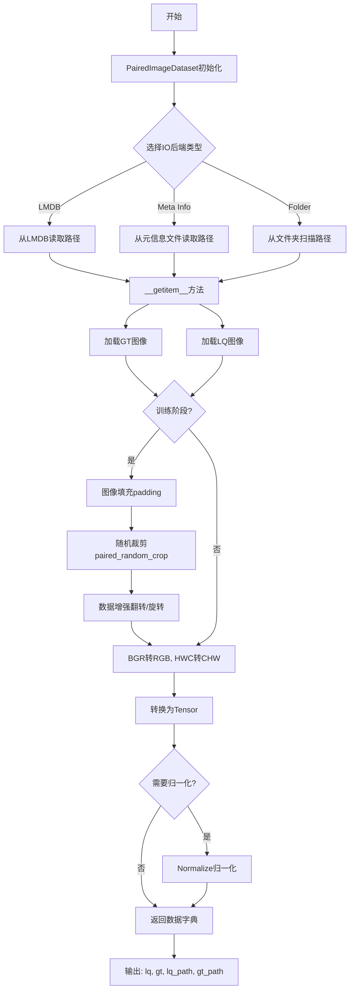
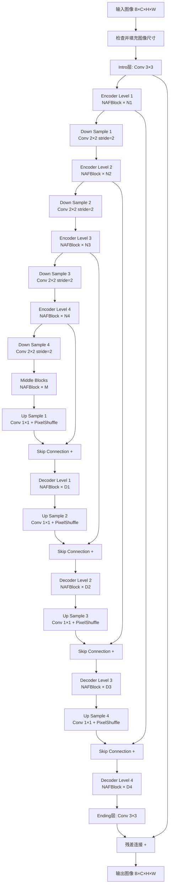
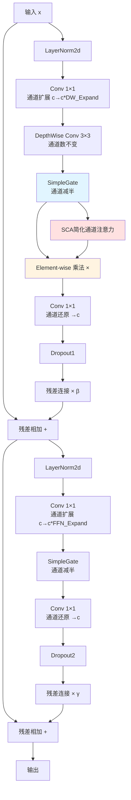

# NAFNet 网络框架与流程分析

## 1. 概述

NAFNet (Nonlinear Activation Free Network) 是一个用于图像复原的简单而有效的基线网络。该网络采用 U-Net 架构，通过去除非线性激活函数，使用简单门控机制（SimpleGate）来实现高效的图像复原任务，包括去噪、去模糊、超分辨率等。

---

## 2. 整体流程图

### 2.1 数据处理流程



### 2.2 NAFNet网络架构流程



### 2.3 NAFBlock 内部结构



---

## 3. 核心组件详解

### 3.1 PairedImageDataset（配对图像数据集）

**功能**：加载和预处理成对的低质量（LQ）和高质量（GT）图像。

**关键特性**：
- **三种数据加载模式**：
  - `lmdb`：从 LMDB 数据库读取（高效）
  - `meta_info_file`：从元信息文件读取路径
  - `folder`：直接扫描文件夹

- **数据增强**（仅训练阶段）：
  - 图像填充（padding）：确保图像尺寸满足裁剪要求
  - 随机裁剪（paired_random_crop）：裁剪出固定大小的图像块
  - 翻转和旋转（augment）：水平翻转、垂直翻转、转置

- **预处理操作**：
  - BGR → RGB 颜色空间转换
  - HWC → CHW 维度转换（适配 PyTorch）
  - 归一化（可选）：使用 mean 和 std 标准化

**输出**：
```python
{
    'lq': 低质量图像张量,
    'gt': 高质量图像张量,
    'lq_path': 低质量图像路径,
    'gt_path': 高质量图像路径
}
```

---

### 3.2 NAFNet 网络架构

**整体结构**：对称的 U-Net 架构

#### 3.2.1 主要模块

| 模块 | 功能 | 实现方式 |
|------|------|----------|
| **Intro层** | 初始特征提取 | Conv 3×3，将输入通道映射到 width |
| **Encoder** | 特征编码 | 多层 NAFBlock + 下采样 |
| **Middle** | 瓶颈层 | 若干 NAFBlock |
| **Decoder** | 特征解码 | 上采样 + Skip Connection + NAFBlock |
| **Ending层** | 输出重建 | Conv 3×3，映射回输入通道数 |

#### 3.2.2 下采样和上采样

- **下采样**：`Conv2d(chan, 2*chan, kernel=2, stride=2)`
  - 空间尺寸减半
  - 通道数翻倍

- **上采样**：`Conv2d(chan, chan*2, 1) + PixelShuffle(2)`
  - 空间尺寸翻倍
  - 通道数减半

#### 3.2.3 Skip Connection（跳跃连接）

- 连接 Encoder 和 Decoder 对应层
- 保留高频细节信息
- 使用简单的加法融合

#### 3.2.4 全局残差连接

```python
output = Ending(features) + input
```
学习残差映射而非直接映射，加速收敛。

---

### 3.3 NAFBlock（核心构建块）

NAFBlock 是 NAFNet 的基本单元，包含两个主要分支。

#### 3.3.1 第一分支：简化通道注意力（SCA）

```
输入 → LayerNorm → Conv1×1 → DWConv3×3 → SimpleGate → SCA × → Conv1×1 → Dropout → ×β → 残差相加
```

**关键组件**：

1. **SimpleGate**：
   ```python
   x1, x2 = x.chunk(2, dim=1)  # 通道维度分成两半
   return x1 * x2               # 逐元素相乘
   ```
   - 替代传统的非线性激活函数（如 ReLU、GELU）
   - 通道数减半
   - 引入非线性的同时保持简单性

2. **SCA（简化通道注意力）**：
   ```python
   AdaptiveAvgPool2d(1) → Conv1×1
   ```
   - 全局平均池化获取通道级全局信息
   - 1×1 卷积学习通道权重
   - 与特征图逐元素相乘

3. **可学习参数 β**：
   - 控制残差分支的贡献程度
   - 初始化为 0，稳定训练

#### 3.3.2 第二分支：前馈网络（FFN）

```
中间输出 → LayerNorm → Conv1×1 → SimpleGate → Conv1×1 → Dropout → ×γ → 残差相加
```

**特点**：
- 通道扩展和压缩
- 增强特征表达能力
- 可学习参数 γ 控制贡献

---

## 4. 关键技术点

### 4.1 SimpleGate 机制

**优势**：
- ✅ 无需复杂的非线性激活函数
- ✅ 计算高效，参数量少
- ✅ 保持信息流动的简洁性
- ✅ 实验证明效果不亚于传统激活函数

### 4.2 图像尺寸处理

```python
def check_image_size(self, x):
    _, _, h, w = x.size()
    mod_pad_h = (self.padder_size - h % self.padder_size) % self.padder_size
    mod_pad_w = (self.padder_size - w % self.padder_size) % self.padder_size
    x = F.pad(x, (0, mod_pad_w, 0, mod_pad_h))
    return x
```

**作用**：
- 确保图像尺寸是 `2^n` 的倍数（n 为编码器层数）
- 避免下采样过程中出现尺寸不匹配
- 推理时自动裁剪回原始尺寸

### 4.3 LayerNorm2d

- 在通道和空间维度上进行归一化
- 相比 BatchNorm，对 batch size 不敏感
- 适合图像复原任务

---

## 5. 训练和推理流程

### 5.1 训练流程


### 5.2 推理流程


---

## 6. 网络配置示例

### 6.1 标准配置（代码中的示例）

```python
# 编码器每层的 NAFBlock 数量
enc_blks = [1, 1, 1, 28]

# 中间层的 NAFBlock 数量
middle_blk_num = 1

# 解码器每层的 NAFBlock 数量
dec_blks = [1, 1, 1, 1]

# 基础通道数
width = 32

# 输入通道数
img_channel = 3
```

**特点**：
- 编码器第 4 层有 28 个 NAFBlock（主要计算集中在低分辨率）
- 解码器相对简单（每层 1 个 NAFBlock）
- 参数主要集中在瓶颈层

### 6.2 通用配置（注释部分）

```python
enc_blks = [2, 2, 4, 8]
middle_blk_num = 12
dec_blks = [2, 2, 2, 2]
```

**特点**：
- 更均衡的层级分布
- 适合一般图像复原任务

---

## 7. 代码关键参数说明

### 7.1 数据集参数

| 参数 | 说明 | 默认值 |
|------|------|--------|
| `dataroot_gt` | GT 图像根目录 | - |
| `dataroot_lq` | LQ 图像根目录 | - |
| `gt_size` | 裁剪的 GT 图像块大小 | - |
| `use_flip` | 是否使用水平翻转 | - |
| `use_rot` | 是否使用旋转 | - |
| `scale` | 缩放倍数（超分任务） | - |
| `phase` | 'train' 或 'val' | - |
| `io_backend` | IO 后端类型 | - |

### 7.2 NAFNet 参数

| 参数 | 说明 | 典型值 |
|------|------|--------|
| `img_channel` | 输入图像通道数 | 3 (RGB) |
| `width` | 基础通道数 | 16/32/64 |
| `middle_blk_num` | 中间层 Block 数量 | 1/12 |
| `enc_blk_nums` | 编码器各层 Block 数量 | [2,2,4,8] |
| `dec_blk_nums` | 解码器各层 Block 数量 | [2,2,2,2] |
| `DW_Expand` | 深度卷积通道扩展倍数 | 2 |
| `FFN_Expand` | FFN 通道扩展倍数 | 2 |
| `drop_out_rate` | Dropout 比率 | 0.0 |

---

## 8. 优势与特点总结

### 8.1 设计优势

1. **简单有效**：去除复杂的非线性激活，使用 SimpleGate
2. **计算高效**：参数量和计算量相对较少
3. **性能优异**：在多个图像复原任务上达到 SOTA
4. **易于训练**：残差连接 + LayerNorm 稳定训练
5. **通用性强**：适用于去噪、去模糊、超分等多种任务

### 8.2 创新点

- ✨ **SimpleGate**：简单而有效的门控机制
- ✨ **无激活函数**：简化网络设计
- ✨ **简化通道注意力**：轻量级注意力机制
- ✨ **可学习残差权重**：β 和 γ 参数动态调节

---

## 9. 应用场景

- 🖼️ **图像去噪**：SIDD 数据集
- 🌫️ **图像去模糊**：GoPro 数据集
- 📹 **视频去模糊**：REDS 数据集
- 🔍 **图像超分辨率**：配合 NAFSSR
- 🎨 **低光增强**
- 🔧 **其他图像复原任务**

---

## 10. 总结

NAFNet 通过简化网络设计，去除非必要的复杂组件，证明了"简单即是美"的设计哲学。其核心思想是：
- 使用简单的 SimpleGate 替代复杂的激活函数
- 使用轻量级的 SCA 注意力机制
- 保持清晰的 U-Net 架构和残差连接

这种设计既保证了性能，又提高了效率，为图像复原领域提供了一个强大而简洁的基线模型。

---

**参考文献**：
```
@article{chen2022simple,
  title={Simple Baselines for Image Restoration},
  author={Chen, Liangyu and Chu, Xiaojie and Zhang, Xiangyu and Sun, Jian},
  journal={arXiv preprint arXiv:2204.04676},
  year={2022}
}
```

